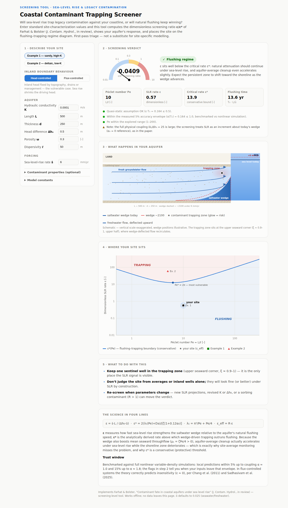

# Contaminant fate in coastal aquifers under sea level rise

**Code, data, and interactive screening tool** accompanying:

> Farhat, S. and Bolster, D. — *Contaminant fate in coastal aquifers under
> sea level rise: analytical solutions for a quasi-static saltwater wedge.*
> Journal of Contaminant Hydrology (in review).

[](LICENSE)
<!-- After the first Zenodo release, add:
[](https://doi.org/10.5281/zenodo.XXXXXXX) -->

Sea level rise pushes the saltwater wedge in head-controlled coastal
aquifers inland, restructuring the flow field that governs legacy
contamination. The paper derives first-order analytical results for what
happens next — local trapping at the upper seaward corner, a mildly
*accelerated* domain-averaged flushing rate (μ₁ = ζPe/4), and a
conservative screening threshold ε\*(Pe, ζ) — and validates all of them
against full nonlinear variable-density simulations of the transient Henry
problem. This repository contains everything needed to reproduce those
results, plus an interactive screening calculator.

## 🔎 The interactive screening tool

**Try it here → [GitHub Pages link — enable Pages on `main`/`docs`, then
this is `https://<user>.github.io/<repo>/`](docs/index.html)**



Enter standard site-characterization values (K, L, d, Δh₀, ω, dispersivity,
SLR rate); the tool computes the screening ratio ε/ε\*, applies the
measured validity checks automatically, draws your aquifer's wedge and
trapping zone, and places the site on the flushing–trapping regime diagram.
Single self-contained HTML file (`docs/index.html`) — no installation, no
network, no data leaves the page.

## Repository contents

```
code/
  henry_solver.py        Full nonlinear variable-density Henry solver
                         (head form, Picard-coupled salt transport,
                         RK2 contaminant transport)          [paper App. E]
  fast_assembly.py       Vectorized sparse operators + steady-state driver
  pert_theory.py         Green's-function evaluation of the O(alpha) theory
  figures.py             LEGACY: original-submission implementation,
                         retained only for comparison (see file header)
  figures_corrected.py   Regenerates all manuscript figures (Figs. 2,3,5,8,
                         4-validity, regime diagram) from the corrected
                         theory                              [paper App. D]
  make_val_figs.py       Validation figures (Figs. 6-7)      [paper Sec. 4]
  bench1_velocity.py     Flow-field benchmark: linearized U1, wedges,
                         Gamma1 fields
  bench3_final.py        Main transport benchmark: static wedges, SLR runs,
                         decay-rate (mu1) test, accuracy map
  test1_flow.py          Diagnostics: solver sanity checks
  test2_decompose.py     Diagnostics: boundary vs interior-buoyancy parts of U1
  test3_whichU1.py       Diagnostics: exact first-order BVP solution for U1
  results/               Benchmark data (.npz) + validation figures
  results_v2/            Corrected manuscript figures
docs/
  index.html             The interactive screening tool (GitHub Pages site)
```

## Reproduce everything

Requires Python ≥ 3.10 with `numpy`, `scipy`, `matplotlib`
(tested with numpy 2.4, scipy 1.17):

```bash
pip install -r requirements.txt
make all          # or run the steps individually:
```

| Step | Command (from `code/`) | Runtime* | Produces |
|---|---|---|---|
| Flow benchmark | `python bench1_velocity.py` | ~1 min | `results/bench1.npz` |
| Transport benchmark | `python bench3_final.py` | ~4 min | `results/bench3.npz` |
| Validation figures | `python make_val_figs.py` | seconds | Figs. 6–7 |
| Manuscript figures | `python figures_corrected.py` | ~3 min | Figs. 2, 3, 5, 8, regime, validity |

\*single core, laptop-class hardware. All results in `results/` and
`results_v2/` are committed, so the figures can also be regenerated without
re-running the benchmarks.

## Key numerical results

The benchmark verifies (paper Section 4):

- solver reproduces the exact 1-D flushing solution at α = 0 to < 10⁻⁴,
  and the exact linearized flow field to rms 7×10⁻⁵;
- ⟨U₁⟩ = ζ/2 exactly, and ∫U₁ dη = ζ²/2 constant in ξ up to α = 2;
- fitted decay rates 3.39 / 4.03 / 4.72 at α = 0 / 0.5 / 1.0 vs the
  adjoint prediction λ₁ + αζPe/4 → 3.39 / 4.02 / 4.64 (**μ₁ = ζPe/4**);
- trapping zone at (ξ, η) ≈ (0.93, 0.50), matching the analytical
  (0.94, 0.50);
- measured first-order accuracy: local error 5% at α ≈ 1.0, 15% at
  α ≈ 1.8; global error < 10% through α = 2.5.

## Citing

If you use this code or the screening tool, please cite the paper (above)
and this repository (see `CITATION.cff`; a Zenodo DOI is minted for each
release — use the version DOI for reproducibility).

## License

MIT — see [LICENSE](LICENSE).
